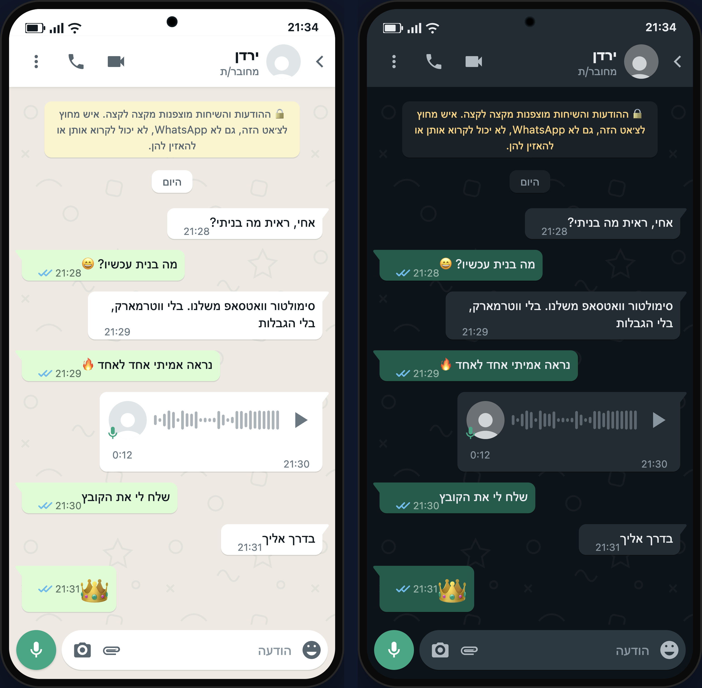
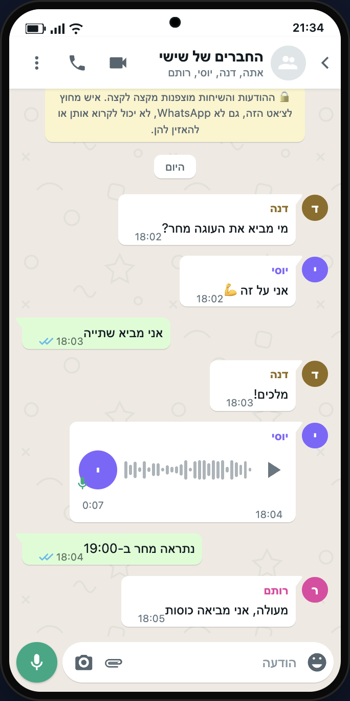

# WhatsApp Animator 💬

סימולטור שיחות וואטסאפ — תצוגה מדויקת אחד־לאחד, אנימציה מלאה, ייצוא PNG ווידאו. קובץ HTML אחד, בלי ווטרמארק, בלי שרת, בלי תלות בכלים חיצוניים.

A pixel-accurate WhatsApp chat simulator & animator in a single HTML file — script-driven conversations, live typing animation with sounds, light/dark mode, full RTL (Hebrew) support, PNG & video export. No watermark, no server, no dependencies.



## שימוש

פותחים את `index.html` בדפדפן. זהו — אין התקנה, אין שרת, קובץ אחד.

```bash
open index.html
```

## מה יש בפנים

- **מראה מדויק** — פלטת הצבעים הרשמית של וואטסאפ (בהיר: `#efeae2` / `#d9fdd3`, כהה: `#0b141a` / `#005c4b` / `#202c33`), בועות עם זנב, וי כפול אפור/כחול `#53bdeb`, טפט משורבט, שורת סטטוס, כותרת עם אייקוני שיחה, שורת קלט עם מיקרופון ירוק `#00a884`
- **אנימציה חיה** — חיווי "מקליד/ה..." בכותרת + בועת שלוש נקודות, הודעות קופצות עם סאונד, וי בודד ← כפול ← כחול
- **תסריט פשוט** — `>` יוצא, `<` נכנס, `# היום` תגית תאריך, `@21:45` שעה ידנית, `קול 0:12` הודעה קולית, `תמונה 1` תמונה שהועלתה
- **עברית מלאה (RTL)** — גם הממשק וגם הטלפון עצמו (ניתן להחליף ל־LTR)
- **מצב כהה / בהיר**, מסגרת טלפון להסרה, מהירות ניגון, תמונת פרופיל
- **קבוצות 👥** — תחביר `< דנה: היי` הופך את הצ'אט לקבוצה אוטומטית: שם שולח בצבע ייחודי (דטרמיניסטי לפי שם, כמו בוואטסאפ), אווטארים קטנים ליד הודעות נכנסות, כותרת עם רשימת המשתתפים, ו"דנה מקליד/ה..." באנימציה

  

- **ייצוא PNG** (html2canvas)
- **ייצוא וידאו 🎥 — MP4 ישירות, בלי ffmpeg ובלי מק** — כפתור "ייצא וידאו" מקליט את הטלפון בלבד (Chrome Region Capture), מריץ את האנימציה עם הצלילים בפסקול, ומוריד את הקובץ. בכרום/אדג' מודרניים (126+) ההקלטה נעשית **ישר ל־MP4 (H.264+AAC)** — עובד על Windows, Linux ומק באותה צורה; בדפדפנים ישנים יותר יורד WebM. בחלון השיתוף בוחרים **"הכרטיסייה הזו"**. המרה ידנית במקרה הצורך: `ffmpeg -i whatsapp-chat.webm -c:v libx264 -pix_fmt yuv420p out.mp4`

## למה בנינו את זה

הכלים הקיימים (Zeoob, FakeWhats, Mockly, TheFake) עולים כסף / מוסיפים ווטרמארק / מוגבלים. הכלי הזה כולו שלנו: קובץ HTML אחד, עריכה חופשית, שליטה מלאה.

## שימוש אחראי

הכלי מיועד להדגמות, תוכן שיווקי, סרטוני הדרכה, סקיצות ומערכונים. לא ליצירת ראיות מזויפות או התחזות לאנשים אמיתיים.
